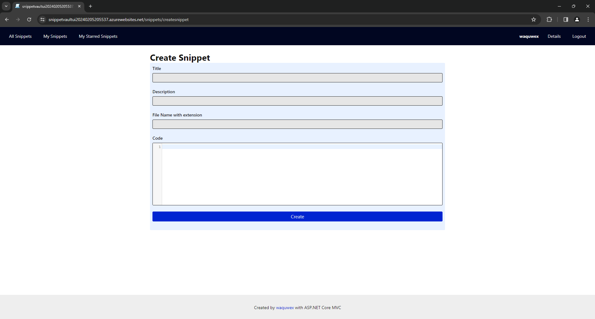

# README

This is a ASP.NET CORE MVC demo project.

## NECESSARY CONFIG
```json
{
  "ConnectionStrings": { // In Azure you get this by specify config in AppService
    "Default": "Data Source=(localdb)\\MSSQLLocalDB;Initial Catalog=SnippetVaultDevv;Integrated Security=True;Connect Timeout=30;Encrypt=False;Trust Server Certificate=False;Application Intent=ReadWrite;Multi Subnet Failover=False"
  },
  "COMMUNICATION_SERVICES_SENDER": "{?}",
  "COMMUNICATION_SERVICES_CONNECTION_STRING": "{?}",
  "SV_AZURE_DB": "{?}" // This is for migratig to Azure DB.
}
```

> When migrate to a AZURE DB using command line use this environment variable: `envRemoteDb="TRUE"`

## FEATURES
* CRUD operations on different entities.
* Onion architecture
* EF Core & Fluent API
* Email service with Azure Communication Services.
* Custom Filters and Middleware
* Custom Validator(including client-side with  jquery-validation-unobtrusive)
* Custom TagHelper
* Session usage
* Custom UserStore & UserManager
* Usage of client library CodeMirror.

## KNOWN BAD POINTS
* Messy CSS.
* No Logging.
* No Unit Tests.
* Exception handling might have better strategy.
* Possible better DB design regarding "Cascade" mechanism.


## SCREENSHOTS
|  |  |  |
| --- | --- | --- |
|  |  |  |
|  |  |  |
|  |  |  |